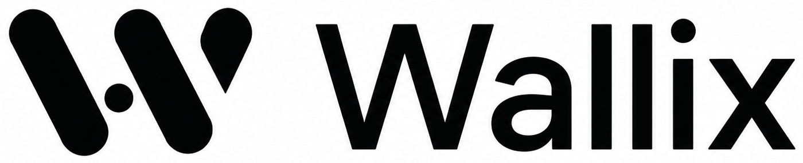
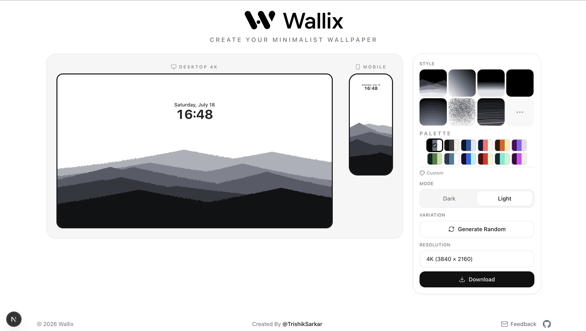

<div align="center">
  
  <h1>Wallix</h1>
  <p><em>Create Your Minimalist Wallpaper.</em></p>
  <p>A browser-based minimalist wallpaper generator that renders true 4K wallpapers directly in your browser — no servers, no uploads, no login.</p>
</div>

<br />

<div align="center">


</div>

<br />



---

## Features

- **13 Minimal Wallpaper Styles** — Mountains, Gradient, Waves, Paper, Rings, Chaos, Dunes, Aurora, Contours, Horizon, Fog, Hills, Orbit
- **True 4K PNG Export** — 3840 × 2160 lossless desktop wallpapers
- **Mobile Wallpaper Export** — 1290 × 2796 lossless mobile wallpapers
- **Live Desktop & Mobile Preview** — Real-time side-by-side preview
- **Light & Dark Modes** — Every style supports both wallpaper modes
- **12 Beautiful Color Palettes** — Curated palettes for every style
- **Custom Palette Creator** — Save your own color palettes
- **Style-specific Randomization** — Endless unique variations per style
- **Instant Browser Rendering** — All generation happens locally on device
- **No Login Required** — No accounts, no data collection
- **Privacy Friendly** — Nothing leaves your browser
- **Fully Responsive** — Works on desktop and tablet
- **Modern Minimal UI** — Clean, Apple-inspired interface

---

## Wallpaper Styles

| Style | Description |
|---|---|
| Mountains | Layered mountain silhouettes with noise-driven terrain |
| Gradient | Smooth linear gradients with configurable angle |
| Waves | Flowing wave landscapes with asymmetric peaks |
| Paper | Subtle noise-based paper texture |
| Rings | Concentric circular rings from an offset origin |
| Chaos | Abstract bezier curve compositions |
| Dunes | Soft sand dune layers with wind distortion |
| Aurora | Vertical glowing light bands |
| Contours | Topographic contour line patterns |
| Horizon | Large smooth horizon color bands |
| Fog | Transparent mist layer overlays |
| Hills | Rounded rolling hill silhouettes |
| Orbit | Minimal concentric orbit paths with satellites |

---


## Tech Stack

| Layer | Technology |
|---|---|
| **Framework** | Next.js 15 (App Router) |
| **UI Library** | React 19 |
| **Language** | TypeScript |
| **Styling** | Tailwind CSS v4 |
| **Rendering** | HTML Canvas 2D API |
| **Animations** | Framer Motion |
| **Icons** | Lucide React |
| **Deployment** | Vercel |
| **Font** | Geist |

---

## Installation

```bash
git clone https://github.com/TrishikSarkar/wallix.git
cd wallix
npm install
npm run dev
```

Open [http://localhost:3000](http://localhost:3000) in your browser.

---

## Build

```bash
npm run build
```

To start the production server:

```bash
npm run start
```

---

## Project Structure

```
src/
├── app/                  # Next.js App Router pages & layout
│   ├── fonts/
│   ├── globals.css
│   ├── layout.tsx
│   └── page.tsx
├── components/           # React UI components
│   ├── controls-card.tsx
│   ├── custom-palette-dialog.tsx
│   ├── download-button.tsx
│   ├── download-modal.tsx
│   ├── footer.tsx
│   ├── header.tsx
│   ├── lock-screen-overlay.tsx
│   ├── mode-selector.tsx
│   ├── palette-selector.tsx
│   ├── preview-card.tsx
│   ├── resolution-select.tsx
│   ├── save-button.tsx
│   ├── style-selector.tsx
│   ├── toast.tsx
│   └── variation-button.tsx
├── lib/                  # Core logic
│   ├── styles/           # Style registry & generators
│   │   ├── types.ts
│   │   ├── registry.ts
│   │   ├── shared.ts
│   │   ├── index.ts
│   │   ├── mountains.ts
│   │   ├── gradient.ts
│   │   ├── waves.ts
│   │   ├── paper.ts
│   │   ├── rings.ts
│   │   ├── chaos.ts
│   │   ├── dunes.ts
│   │   ├── aurora.ts
│   │   ├── contours.ts
│   │   ├── horizon.ts
│   │   ├── fog.ts
│   │   ├── hills.ts
│   │   └── orbit.ts
│   ├── custom-palettes.ts
│   ├── utils.ts
│   ├── wallpaper-context.tsx
│   └── wallpaper-engine.ts
└── ...
```

---

## Highlights

- **True 4K Rendering** — Export at native 3840 × 2160 (desktop) and 1290 × 2796 (mobile)
- **Lossless PNG** — No compression artifacts, no quality loss
- **No Server Rendering** — Every pixel is generated client-side via the Canvas 2D API
- **No Image Uploads** — Your wallpapers never leave your device
- **Fast & Lightweight** — Instant generation, minimal bundle size
- **Privacy-first** — No tracking, no analytics, no data collection

---

## Roadmap

- [x] 13 wallpaper styles
- [x] 4K desktop export
- [x] Mobile export
- [x] Custom palettes
- [x] Light / Dark mode
- [ ] More wallpaper styles
- [ ] Favorite / save styles
- [ ] Export presets (JPEG, WebP)
- [ ] Additional color palettes
- [ ] Improved mobile experience
- [ ] Wallpaper theme sharing
- [ ] Community preset gallery

---

## Contributing

Contributions are welcome!

1. Fork the repository
2. Create a feature branch (`git checkout -b feature/amazing-feature`)
3. Commit your changes (`git commit -m 'Add amazing feature'`)
4. Push to the branch (`git push origin feature/amazing-feature`)
5. Open a Pull Request

Please ensure your code passes TypeScript checks (`npx tsc --noEmit`) and follows the existing code style.

---

## License

This project is licensed under the MIT License — see the [LICENSE](./LICENSE) file for details.

---

## Author

<div align="center">
  <p>Created by <strong>Trishik Sarkar</strong></p>
  <p>
    <a href="https://github.com/TrishikSarkar">GitHub</a>
    ·
    <a href="https://linkedin.com/in/trishik-sarkar">LinkedIn</a>
    ·
    <a href="mailto:trishiksarkar1508@gmail.com">Email</a>
  </p>
  <p>Feedback & suggestions: <a href="mailto:trishiksarkar1508@gmail.com">trishiksarkar1508@gmail.com</a></p>
</div>

<br />

---

<div align="center">
  <sub>Made with ❤️ using Next.js, TypeScript & Canvas API.</sub>
</div>
